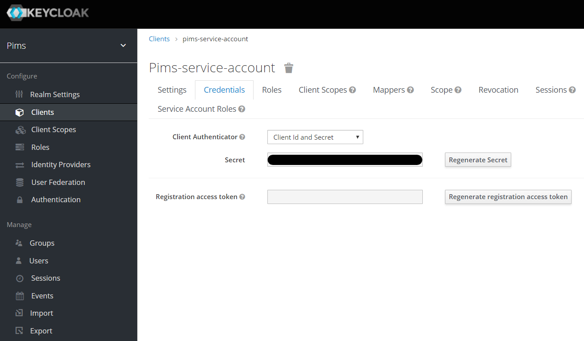

# PIMS Import Tool

The PIMS Import Tool provides a way to parse a JSON file containing an array of items and send bundled HTTP requests to a configured API endpoint for the purpose of importing data.

This console application can send any type of array of JSON objects to any API endpoint.

Use this console application to import inventory data into PIMS.

## Setup

Create a `.env` file and populate it with the following;

```
ASPNETCORE_ENVIRONMENT=Development
Keycloak__TokenUrl={URL to Keycloak token endpoint (i.e. https://sso-dev.pathfinder.gov.bc.ca/auth/realms/quartech/protocol/openid-connect/token)}
Keycloak__ClientId={Keycloak client ID (i.e. pims-service-account)}
Keycloak__ClientSecret={Keycloak client secret}
Api__ImportUrl={URL to endpoint (i.e. http://pims-dev.pathfinder.gov.bc.ca/api/tools/import/properties)}
Import__File=./Data/properties.json
```

Some of these settings have default values contained in the `appsettings.json` configuration file.

| Key                      | Required | Description                                                                                       |
| ------------------------ | :------: | ------------------------------------------------------------------------------------------------- |
| Keycloak\_\_TokenUrl     |    X     | The URL to the keycloak token endpoint.                                                           |
| Keycloak\_\_Audience     |          | The Keycloak realm (default: ClientId) audience.                                                  |
| Keycloak\_\_ClientId     |    X     | The Keycloak client ID.                                                                           |
| Keycloak\_\_ClientSecret |    ?     | The Keycloak client secret. **Required if Api:AccessToken not provided.**                         |
| Api\_\_Uri\_             |    X     | The URI to the API.                                                                               |
| Api\_\_ImportUrl         |    X     | The URL to the endpoint you want to send the request to.                                          |
| Api\_\_HttpMethod        |          | HTTP Method to use in the request (default: POST).                                                |
| Import\_\_File           |    X     | The path to the JSON file to parse and iterate through. The JSON should be an array of items.     |
| Import\_\_Delay          |          | The number of seconds to delay between each request (default: 0).                                 |
| Import\_\_Quantity       |          | The number of items to send in each request (default: 50, max: 100)                               |
| Import\_\_Skip           |          | The number of items to skip in the imported JSON array.                                           |
| Import\_\_Iterations     |          | The number of requests to make before cancelling the import (default = 0, which means don't stop) |
| RetryAfterFailure        |          | Whether to retry a request after a failure.                                                       |
| RetryAttempts            |          | How many retries after a failure should be sent.                                                  |
| AbortAfterFailure        |          | After how many failures should the import be aborted.                                             |

If you prefer, you can add your JSON files to the `/backend/tools/import/Data` folder and they will be ignored by **git**.

## Seeding the database - Makefile

A `Makefile` is provided within this folder to automate the process of:

- Requesting a keycloak token for **pims-service-account**
- Activating the service account via an API call
- Seeding the docker database via `dotnet run`

#### Available commands

```bash
make run
```

If you need to troubleshoot;

```bash
make token
# Your JWT token is: ey7hb....a1Q
make help
```

#### Requirements

For the `Makefile` to work you will need to:

1. Ensure a valid `[.env]` file is present;

2. Ensure the solution is currently running in docker; i.e `docker-compose up -d`

3. Ensure **Make** is installed in your shell. It comes pre-installed on macOS. For Windows, you can install `gnu-make` via [chocolatey](https://chocolatey.org/) or [scoop](https://scoop.sh/)

   ```bash
   choco install make
   # -OR-
   scoop install make
   ```

_Alternatively, you can follow the instructions below to seed the database manually_

## Seeding the database manually

To run the application ensure the configuration files are present and the JSON data file is in the correct location (i.e. the `/Data` folder).

Please note that the account with which you connect with, must be **activated** before running the import as the _DAL_ will attempt to associate all records that are imported with this account.

Additionally the account must have the appropriate Keycloak roles (i.e. `system-administrator`) to request the API endpoint.

When using `Keycloak:ClientId=pims-service-account` you will need to do the following (use Postman or `curl`);

1. Open Keycloak management console (running at http://keycloack:8080) and copy the client secret for `pims-service-account`;

   

2. Get a valid keycloak token for the service account - make sure to provide the correct **client_secret**;

   **NOTE** - Ensure you have an `.env` file setup with relevant environment variables before sourcing it

   ```bash
   [[ -f .env ]] && source .env
   KC_TOKEN=$(curl -L -X POST "http://keycloak:8080/auth/realms/pims/protocol/openid-connect/token" \
   --header "Content-Type: application/x-www-form-urlencoded" \
   --data-urlencode "grant_type=client_credentials" \
   --data-urlencode "audience=pims-service-account" \
   --data-urlencode "client_id=pims-service-account" \
   --data-urlencode "client_secret=${Keycloak__ClientSecret}" | jq -r '.access_token')
   ```

3. Make a request to the `/api/auth/activate` endpoint using that JWT token;

   ```bash
   curl -v -L -X POST "http://localhost:5000/api/auth/activate" \
   --header "Content-Length: 0" \
   --header "Authorization: Bearer ${KC_TOKEN}"
   ```

4. Go to the `/backend/tools/import` folder and execute the following;

   ```bash
   dotnet run
   ```

   Alternatively, you can execute the compiled build directly if you have your environment variables setup.

   ```bash
   Pims.Tools.Import.exe
   ```
