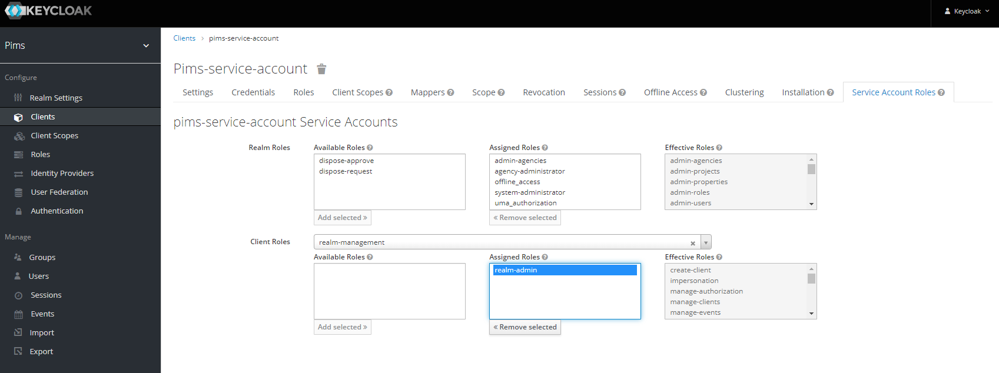

# Keycloak Sync Tool

The Keycloak Sync Tool provides a way to configure Keycloak so that PIMS will work correctly.
This includes creating Keycloak Roles, Groups and Clients and configuring each to have the correct settings.
The tool will align the PIMS database users, roles and claims with Keycloak objects.
Additionally any users within Keycloak will be added to PIMS.

## Setup

First login to Keycloak, create the `pims-service-account` Client and apply the appropropriate roles for this tool to work.

> Regrettably I have not discovered a way yet to authenticate without a known Client.

1. Login to Keycloak Realm
2. Create the `pims` Realm
   1. Name = `pims`
3. Create the `pims-service-account` Client

   1. Client ID = `pims-service-account`
   2. Client Protocol = `openid-connect`
   3. Root URL = `http://localhost:3000/api`

   #### Settings

   - Login Theme = `keycloak`
   - Access Type = `confidential`
   - Standard Flow Enabled = `true`
   - Implicit Flow Enabled = `false`
   - Direct Access Grants Enabled = `true`
   - Service Accounts Enabled = `true`
   - Authorization Enabled = `false`
   - Root URL = `http://localhost:3000/api`
   - Valid Redirect URIs = `http://localhost:3000/api/*`
   - Base URL = `/`
   - Web Origins = `*`

   #### Service Account Roles

   - Client Roles = `realm-management`
   - Assigned Roles = `realm-admin`

   

4. Copy the Client Secret and place it in your `.env` file. And update the environment value to the appropiate one _[Local, Development, Test, Production]_.\_

   ```conf
   ASPNETCORE_ENVIRONMENT=Local
   Keycloak__ClientSecret={Client Secret}
   ```

5. Run the Keycloak Sync Tool

   ```bash
   dotnet run
   ```

> NOTE - If you have users in your pims database that have `agencies` attributes of non-existing agencies, you will receive errors in the last portion of the sync when attempting to reconcile users. You can ignore these errors for the most part, but realize that the users will need to be manually updated with correct agency values when you login to PIMS (using a **System Administrator** account).
