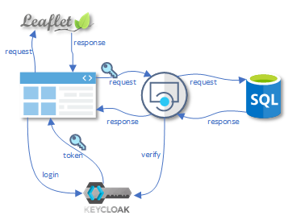
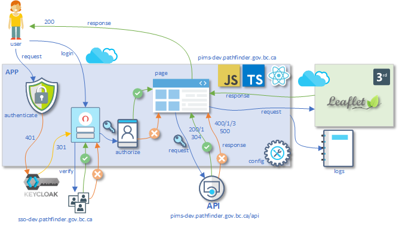
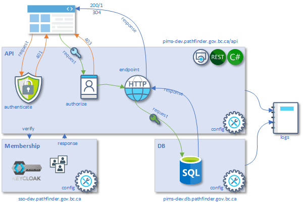
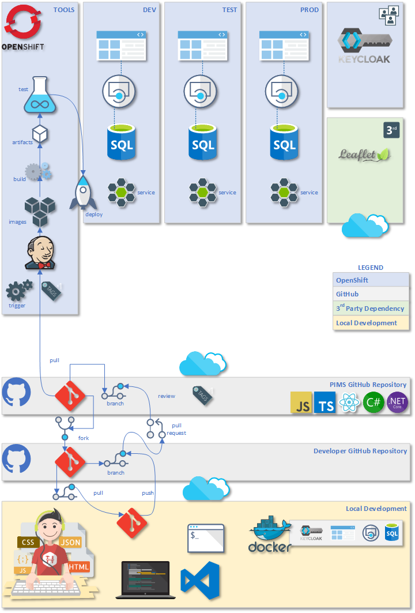

# Technical Architecture

The PIMS solution follows a standardized approach which keeps each component independent and within its own container. This allows for scalability that can be applied dynamically when required. As the solution is developed the architecture will reflect this change by becoming more complex and including additional components (i.e. caching, load balancing, services).

### Membership

PIMS access requires a validated account to access. A user with one of the following account types; IDIR, BCeID (optionally we may also support GitHub or a custom account).

### APP Architecture

The front-end application is a React app. It is hosted by Nginx and the React app is built for a production release. It is developed with TypeScript to improve standards. It uses KeyCloak for authentication. The JWT token will contain authorization information and allows for communication with the API.

Additionally there is a 3rd party dependency with Leaflet for GIS maps and functionality.

### API Architecture

The back-end application is a .NET Core 3.1 RESTful API app. It is hosted in a linux container. It uses KeyCloak for authentication and authorization. Communication to it requires a JWT Bearer token.

The API is connected to an MSSQL database hosted in a linux container.

### OpenShift Architecture

The DevOps platform that supports CI/CD along with the Operations platform environments are hosted with OpenShift. Additionally KeyCloak which provides authentication and authorization is hosted within OpenShift.

The PIMS solution will be hosted within the OpenShift environment provided by the Exchange Lab ([here](https://console.pathfinder.gov.bc.ca:8443/console/projects)).

