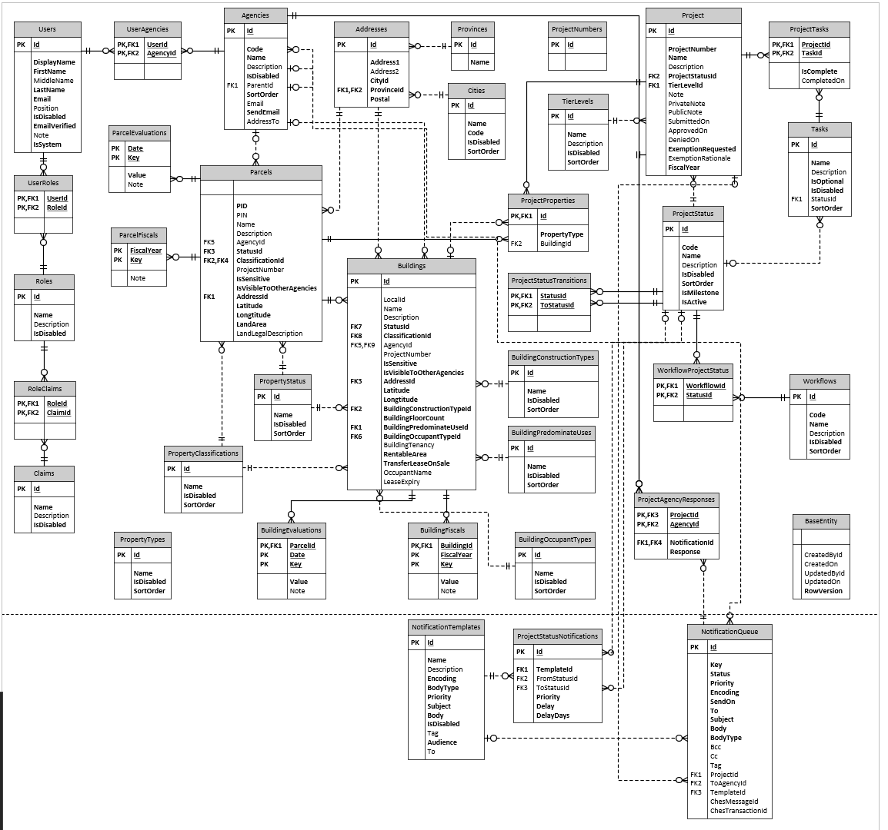

# Database

The PIMS solution currently uses a MSSQL datasource hosted within a Linux container. This database provides the primary data storage for the API and contains all Property information.

> The design of the database schema will change over the course of the project as each iteration provides additional features and functionality.

## Platform

**Microsoft SQL Server** 2019

[Docker Image](mcr.microsoft.com/mssql/rhel/server:2019-latest)

## Additional Links and Information

- [SQL Server 2019](https://www.microsoft.com/en-ca/sql-server/sql-server-2019)
- [MSSQL - Linux 2019](https://docs.microsoft.com/en-us/sql/linux/sql-server-linux-release-notes-2019?view=sql-server-ver15)
- [MSSQL - Redhat v15](https://docs.microsoft.com/en-us/sql/linux/quickstart-install-connect-red-hat?view=sql-server-ver15)
- [MSSQL - Linux v15](https://docs.microsoft.com/en-us/sql/linux/sql-server-linux-setup?view=sql-server-ver15)

## Architectural Design

The primary purpose of this datasource is to maintain an inventory of properties (Parcels, Buildings and Projects). Additionally to authorize and associate Users with their respective properties. There are also a number of supporting lists to support the front-end application user experience.

### Enterprise Relational Diagram

## Object Information

As the current primary purpose of the PIMS DB is to manage inventory of properties, the structure revolves around the the two property objects **Parcels** and **Buildings**. A Parcel object represents land, and it can contain many Building objects. Additionally the DB provides a structure to support properties being owned by an **Agency**, so that the appropriate **Users** have authority to manage it.

Most objects will also include tracking columns to identify when it was created or updated and who created and updated it. Additionally objects will natively provide optimistic concurrency enforcement, which will ensure data is not overwritten in a multi-user concurrent solution.

### Objects

The following are the primary objects;

| Object    | Description                                                  |
| --------- | ------------------------------------------------------------ |
| Parcels   | Land inventory                                               |
| Buildings | Building inventory                                           |
| Projects  | Project inventory (disposal, aquisition)                     |
| Users     | Users accounts within PIMS                                   |
| Roles     | Roles that authorize abilities within PIMS                   |
| Agencies  | A ministry, crown corporation or entity that owns properties |
| Addresses | A physical address to a location                             |

### Lists

The following provide a way to manage lists of values within the solution;

| Object                    | Description                                  |
| ------------------------- | -------------------------------------------- |
| PropertyTypes             | List of property types [land \| building]    |
| PropertyClassifications   | List of property classifications             |
| PropertyStatus            | List of property status                      |
| Cities                    | List of cities                               |
| Provinces                 | List of provinces                            |
| BuildingConstructionTypes | List of building construction types          |
| BuildingPredominateUses   | List of building predominate uses            |
| BuildingOccupantTypes     | List of building occupant types              |
| TierLevels                | List of project tier levels                  |
| Project Status            | List of project status                       |
| Tasks                     | List of tasks to complete a process or stage |
