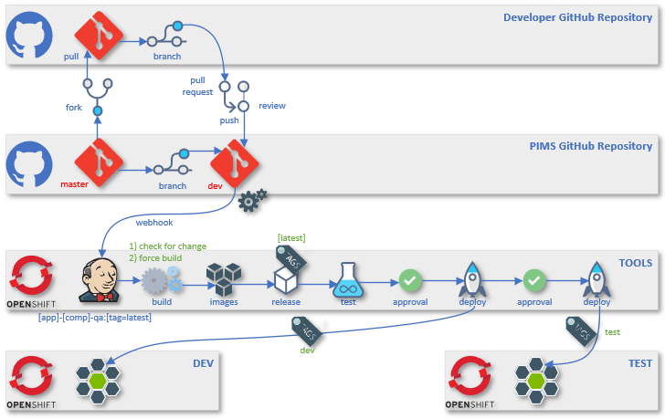
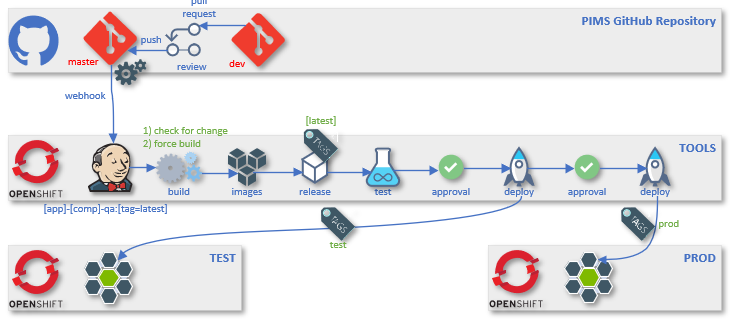

# DevOps Continuous Integration / Continous Deployment

First it was [Waterfall](https://en.wikipedia.org/wiki/Waterfall_model), next it was [Agile](https://en.wikipedia.org/wiki/Agile_software_development), and now it's [DevOps](https://aws.amazon.com/devops/what-is-devops/). This is how modern developers approach building great products. With the rise of DevOps has come the new methods of Continuous Integration, Continuous Delivery, (CI/CD) and Continuous Deployment. Conventional software development and delivery methods are rapidly becoming obsolete. Historically, in the agile age, most companies would deploy/ship software in monthly, quarterly, bi-annual, or even annual releases. Now we build and deploy multiple times a day.

**Continuous integration** focuses on blending the work products of individual developers together into a repository. Often, this is done several times each day, and the primary purpose is to enable early detection of integration bugs, which should eventually result in tighter cohesion and more development collaboration. The aim of **continuous delivery** is to minimize the friction points that are inherent in the deployment or release processes. Typically, the implementation involves automating each of the steps for build deployments such that a safe code release can be done—ideally—at any moment in time. **Continuous deployment** is a higher degree of automation, in which a build/deployment occurs automatically whenever a major change is made to the code.

## PIMS CI/CD

The PIMS project currently uses [GitHub Actions](https://github.com/features/actions), [OpenShift](https://www.openshift.com/) and [Jenkins](https://www.jenkins.io/) to support CI/CD.

The general highlevel workflow is as follows;

1. Fork Repo
1. Clone Repo
1. Submit PR to `dev` branch
1. **GitHub Action** - Run Unit Tests
1. **GitHub Action** - Run Code Coverage ([CodeCov](https://codecov.io/gh/bcgov/PIMS))
1. Merge PR into `dev` branch
1. **Jenkins** - Run **OpenShift** - Build Configuration
1. **Jenkins** - Run Unit Tests
1. **Jenkins** - Run Code Coverage ([SonarQube](https://sonarqube-jcxjin-tools.pathfinder.gov.bc.ca/about))
1. **Jenkins** - Run Security Analysis ([ZAP](https://www.owasp.org/index.php/OWASP_Zed_Attack_Proxy_Project))
1. **Jenkins** - Redirects traffic to Maintenance Pod
1. **Jenkins** - Tag build images
1. **Jenkins** - Run **OpenShift** - Deployment Configuration
1. **Jenkins** - Run **OpenShift** - Deployment Configuration DB Migration
1. **OpenShift** - Orchestrate Pods
1. **OpenShift** - Orchestrate Containers
1. **OpenShift** - Orchestrate Storage
1. **OpenShift** - Orchestrate Routes
1. **Jenkins** - Removes traffic redirection from Maintenance Pod

## Environments

There are four projects within OpenShift that are named, [TOOLS](https://console.pathfinder.gov.bc.ca:8443/console/project/jcxjin-tools/overview), [DEV](https://console.pathfinder.gov.bc.ca:8443/console/project/jcxjin-dev/overview), [TEST](https://console.pathfinder.gov.bc.ca:8443/console/project/jcxjin-test/overview), [PROD](https://console.pathfinder.gov.bc.ca:8443/console/project/jcxjin-prod/overview).
Three of which represent the environments where PIMS instances will reside.
The fourth is TOOLS which hosts tooling such as Jenkins, SonarQube and others.

### Environments

| Name | URL                                                                      | Description                            |
| ---- | ------------------------------------------------------------------------ | -------------------------------------- |
| DEV  | [pims-dev.pathfinder.gov.bc.ca](https://pims-dev.pathfinder.gov.bc.ca)   | The development environment for QA     |
| TEST | [pims-test.pathfinder.gov.bc.ca](https://pims-test.pathfinder.gov.bc.ca) | The testing environment for QA and UAT |
| PROD | [pims.gov.bc.ca](https://pims.gov.bc.ca)                                 | The production environment             |

## Branching

Repository branches are used to manage development.
There are two primary branches [master](https://github.com/bcgov/PIMS/tree/master) and [dev](https://github.com/bcgov/PIMS/tree/dev).

| Branch        | Description                                                                          |
| ------------- | ------------------------------------------------------------------------------------ |
| `master`      | This is the root branch and represents completed features and a released version.    |
| `dev`         | This branch is used for the development of new features, enhancements and bug fixes. |
| `{pims-####}` | These branches are normally hosted in forked repositories and link to Jira Stories.  |

### Dev Branch

The `dev` branch is deployed to the [DEV](https://pims-dev.pathfinder.gov.bc.ca) environment primarily, but can also be deployed to the [TEST](https://pims-test.pathfinder.gov.bc.ca) environment.

#### DEV Environment

As changes are merged the CI/CD pipeline build and deploy to the [DEV](https://pims-dev.pathfinder.gov.bc.ca) environment.

The CI/CD process determines if changes were made. If they were not, it will ask if you want to force a rebuild. If the build, test and scan process completed successfully it will deploy the new build and spin up new containers.

This makes the **DEV** branch unstable, as it can change mulitple times per day.

Initial QA testing is performed in the **DEV** environment.

#### TEST Environment

Additionally to support a more stable QA process, the images tagged with `dev` can be deployed to the [TEST](https://pims-test.pathfinder.gov.bc.ca) environment.

Within OpenShift there is a pipeline that can be initalized to automate this process.

The purpose of this is to allow QA or UAT to choose when they want to receive a new build (features, enhancements and bug fixes).

### Master Branch

The `master` branch primary purpose is to support production releases.

It is first deployed to the [TEST](https://pims-test.pathfinder.gov.bc.ca) environment to allow QA and UAT to review the prepared release and signoff before it can be deployed to production.

Upon acceptance of the release the `master` branch is deployed to the [PROD](https://pims.gov.bc.ca) environment.

## CI/CD Pipelines

There are four principle pipelines created to support the PIMS solution.
These pipelines are supported by Jenkins and OpenShift tools that enable automated build, test, review and deployment of new releases.

| Name                   |                  Destination                   | Trigger | Description                                                                                                  |
| ---------------------- | :--------------------------------------------: | :-----: | ------------------------------------------------------------------------------------------------------------ |
| cicd-pipeline          |  [DEV](https://pims-dev.pathfinder.gov.bc.ca)  |  Auto   | **Builds and deploys** the `dev` branch. Tags images with `dev`.                                             |
| cicd-dev-test-pipeline | [TEST](https://pims-test.pathfinder.gov.bc.ca) | Manual  | **Deploys** the build images tagged with `dev`.                                                              |
| cicd-test-pipeline     | [TEST](https://pims-test.pathfinder.gov.bc.ca) |  Auto   | **Builds and deploys** the `master` branch. Tags images with `test`. Tags images with `version (i.e. 1.0.2)` |
| cicd-prod-pipeline     |         [PROD](https://pims.gov.bc.ca)         | Manual  | **Deploys** the build images tagged with a specified `version`.                                              |

### Image Tagging

Images are tagged within OpenShift to identify their version, feature, or environment they should be deployed to.

Read more - [here](https://docs.openshift.com/container-platform/4.3/openshift_images/managing_images/tagging-images.html)

## Development Releases

During a Sprint there will be numerous commits to the `dev` branch. These will trigger the `cicd-pipeline` to build, test, scan, tag and deploy a new release to the **DEV** environment (optionally to the **TEST** environment).

## Production Releases

Every Sprint a new releasable increment is developed.
These new releases will follow our [versioning](./VERSIONS.md) strategy (`1.0.0` = `[major.minor.patch]`).

When a releaseable increment is ready a PR will be created to merge the `dev` branch into the `master` branch. Upon review and acceptance the `master` branch will be updated, which will inform the Jenkins pipeline to automatically build and deploy a new release to the **TEST** environment.

During the pipeline execution it will prompt a request for a _tag_ name. The tag should be the version number selected for the release (i.e. `1.2.4-alpha`). The pipeline will build, test and review the release and also add the `test` tag. The result will be deployed to the **TEST** environment.

After QA and UAT of the release in the **TEST** environment has been approved a _manually_ triggered production pipeline can be scheduled and run. The production pipeline will prompt for the appropriate version to release.

During the production release a full database backup will occur of the production data. This will be performed in the case of an immediate rollback being required after a failed deployment.

### Production Release Steps

| Step | Name           | Destination | Description                                               |
| ---: | -------------- | ----------- | --------------------------------------------------------- |
|    1 | Merge `master` |             | Merge the PR                                              |
|    2 | Trigger        |             | Automatic trigger from source to run `cicd-test-pipeline` |
|    3 | Prompt         |             | Request `version` tag for the release                     |
|    4 | Build          |             | Build the source                                          |
|    5 | Test           |             | Run automated unit-tests                                  |
|    6 | Scan           |             | Scan code for issues                                      |
|    7 | Redirect       | MAINT       | Redirect traffic to the maintenance pod                   |
|    8 | Tag            |             | Tag branch with `test` and `version`                      |
|    9 | Deploy         | TEST        | Deploy `test` images to environment                       |
|   10 | Redirect       | TEST        | Remove maintenance pod redirection                        |
|   11 | QA             |             | Manually test and approve release                         |
|   12 | UAT            |             | Client test and approves release                          |
|   13 | Schedule       |             | Schedule a release to production                          |
|   14 | Trigger        |             | Manually initiate `cicd-prod-pipeline`                    |
|   15 | Prompt         |             | Request `version` tag for the release                     |
|   16 | Redirect       | MAINT       | Redirect traffic to the maintenance pod                   |
|   17 | Backup         |             | Backup the production database                            |
|   18 | Deploy         | PROD        | Deploy `version` images to environment                    |
|   19 | Redirect       | PROD        | Remove maintenance pod redirection                        |

### Rollback

If a failure occurs during the deployment phase it will be necessary to rollback the release images that were deployed and restore the database backup. During this time the redirect to the maintenance pod will remain until the rollback has successfully been implemented.

To support `after-the-fact` rollbacks it will be required to generate full migration scripts that allow for this **[out-of-scope]**.
