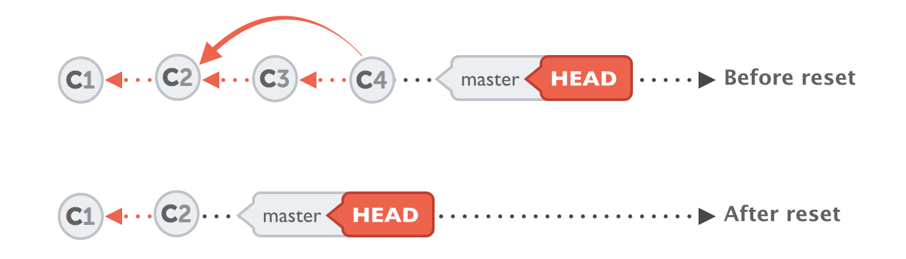
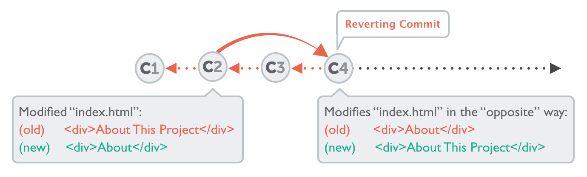

# GitHub Developer Workflow

This document describes how to work with the GitHub repository.

## 1 Fork in the cloud

1. Visit [https://github.com/bcgov/PIMS](https://github.com/bcgov/PIMS)
2. Click `Fork` button (top right) to establish a cloud-based fork.

## 2 Clone fork to local workstation

Create your clone:

```sh
git clone https://github.com/[username]/PIMS.git

cd PIMS

git remote add upstream https://github.com/bcgov/PIMS.git

# Never push to upstream master!
git remote set-url --push upstream no_push

# Confirm that your remotes make sense:
git remote -v

# output should be something like:
origin  https://github.com/[username]/PIMS.git (fetch)
origin  https://github.com/[username]/PIMS.git (push)
upstream        https://github.com/bcgov/PIMS.git (fetch)
upstream        no_push (push)
```

:zap: This will prevent accidentally pushing to the main repository.

## 3 Branch your code

First, get your local branches up to date:

```sh
git fetch upstream
git checkout dev
git rebase upstream/dev
```

Branch from it:

```sh
git checkout -b myfeature
```

Then edit code on the `myfeature` branch.

## 4 Keep your branch in sync

While you are working on the changes in your branch, ensure that you stay up to date
with the main repository. This will reduce merge problems.

```sh
# While on your myfeature branch
git fetch upstream
git rebase upstream/dev
```

Please don't use **`git pull`** instead of the above **`fetch`** / **`rebase`**. `git pull` does a merge,
which leaves merge commits. These make the commit history messy and violate the principle that commits
ought to be individually understandable and useful (see below).

## 5 Commit

### Using the command line

Commit your changes.

```sh
git commit
```

Likely you go back and edit/build/test some more then `git commit`
in a few cycles.

### Using VS Code

In VS Code left hand navigation, click the Source Control logo to bring up the view.

You will need to "stage" your changes before committing. To stage files that are added or edited, either right-click the file and select _Stage Changes_ or click the _+_ symbol to the right of the filename.

When ready to commit, enter a message in the text box at the top of the Source Control view. `CTRL + Enter` will commit the staged changes.

## 6 Push

When ready to review (or just to establish an offsite backup of your work),
push your branch to your fork on `github.com`:

### Push - Using the command line

```sh
git push origin myfeature
```

### Push - Using VS Code

* In VS Code open the Source Control view.
* Click the three-dot menu (`...`)
* Click `Push to...` and select _origin_.

## 7 Squash your commits before a pull request

Upon merge (by either you or your reviewer), all commits left on the review
branch should represent meaningful milestones or units of work. Use commits to
add clarity to the development and review process.

Before submitting a PR, squash any _fix review feedback_, _typo_, _merged_, and
_rebased_ sorts of commits.

In particular, if you happened to have used `git merge` and have merge
commits, please squash those away: they do not meet the above test.

A nifty way to manage the commits in your PR is to do an [interactive
rebase](https://git-scm.com/book/en/v2/Git-Tools-Rewriting-History),
which will let you tell git what to do with every commit:

```sh
git fetch upstream
git rebase -i upstream/master
```

For mass automated fixups (e.g. automated doc formatting), use one or more
commits for the changes to tooling and a final commit to apply the fixup en
masse. This makes reviews easier.

## 8 Create a pull request

1. Visit your fork at `https://github.com/[username]/PIMS`
1. Click the `Compare & Pull Request` button next to your `myfeature` branch.
1. Carefully review all of your changes to ensure that you have not committed anything by accident.

## 9 Get a code review

Once your pull request has been opened, assign it to one or more reviewers. Those reviewers will do a thorough code review, looking for
correctness, bugs, opportunities for improvement, documentation and comments,
and style.

Commit changes made in response to review comments to the same branch on your
fork.

Very small PRs are easy to review.  Very large PRs are very difficult to review.

## 10 Keep your fork up-to-date

After your pull request has been merged, you will want to bring those changes into your fork.

```sh
# Ensure you are in the dev branch
git checkout dev
git fetch upstream
git rebase upstream/dev
git push
```

# Advanced Git Commands

This section covers some advanced use cases with Git.

:zap: These commands shouldn't be part of your daily development workflow, unless things are going badly with your repo.

## How to undo the last commit

First, before we bring the big guns in, let's make sure you really need them. Because in case you just want to edit your last commit, you can simply use Git's amend feature. It allows you to correct the last commit's message as well as add more changes to it. If that's what you want to do, [read more about amend](https://www.git-tower.com/learn/git/ebook/en/command-line/advanced-topics/undoing-things#start).

There's two flavours for "undoing" things in git:

```sh
# soft reset
git reset --soft HEAD~1

# hard reset - careful!
git reset --hard HEAD~1
```

Note the **`--soft`** flag: this makes sure that the changes in undone revisions are preserved. After running the command, you'll find the changes as uncommitted local modifications in your working copy.

If you don't want to keep these changes, simply use the `--hard` flag. This tells Git to replace the files in your working copy with the "HEAD - 1" revision (which is the last committed version), discarding all local changes.

:zap: Be sure to only do this when you're sure you don't need these changes anymore!

### How to undo MULTIPLE commits

The same technique allows you to return to any previous revision:

```sh
# Find the commit id (SHA) you want to revert to, then
git reset --hard 0ad5a7a6 # <-- the commit SHA

# You will need to "force" push your changes back to GitHub
git push -f
```

:zap: Always keep in mind, however, that using the reset command **undoes all commits** that came after the one you returned to:



### Reverting a commit

Sometimes you'll want to undo a certain commit. E.g. when you notice that your changes were wrong, when you introduced a bug, or simply when the customer has decided he doesn't want this anymore.

Using the "git revert" command is one possibility to undo a previous commit. However, the command doesn't delete any commits. Instead, it reverts the effects of a certain commit, effectively undoing it. It does this by producing a new commit with changes that revert each of the changes in that unwanted commit. For example, if your original commit added a word in a certain place, the reverting commit will remove exactly this word, again.



In case you wish to revert a commit, use the following instructions.

* Create a branch and sync it with upstream.

  ```sh
  # create a branch
  git checkout -b myrevert

  # sync the branch with upstream
  git fetch upstream
  git rebase upstream/master
  ```

* If the commit you wish to revert is a:
  * **merge commit:**

    ```sh
    # SHA is the hash of the merge commit you wish to revert
    git revert -m 1 SHA
    ```

  * **single commit:**

    ```sh
    # SHA is the hash of the single commit you wish to revert
    git revert SHA
    ```

* This will create a new commit reverting the changes. Push this new commit to your remote.

```sh
git push origin myrevert
```

* [Create a Pull Request](#8-create-a-pull-request) using this branch.

### Attribution

This page heavily borrowed from the [kubernetes.io](https://github.com/kubernetes/community/blob/master/contributors/guide/github-workflow.md) project.
