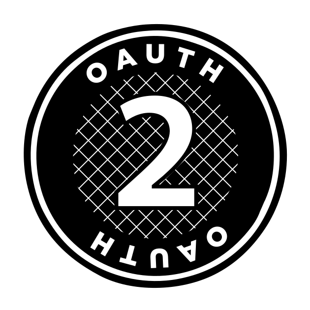
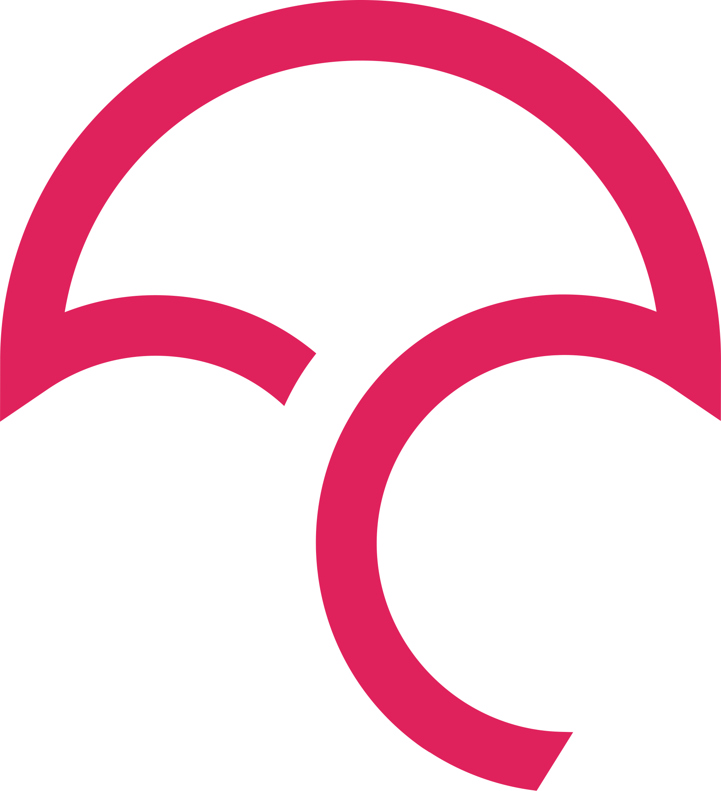
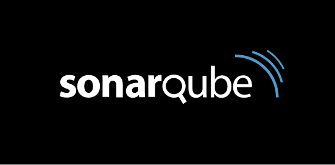

# Property Inventory Management System (PIMS)

The PIMS solution will provide a geo-spatial inventory of properties to assist Strategic Real Estate Services branch of Real Property Division to manage and oversee the disposal of assets surplus to government, optimize the benefits to the government and citizens of BC related to the management of public real estate assets, and be a trusted source for accurate information for Government owned titled property.

## Description

The PIMS technical architecture stack continues to grow as features and enhancements are added. The current components and integrations are listed below;

## Documentation

- [Architecture](./ARCHITECTURE.md)
- [Start Developing](./DEVELOPMENT.md)
- [GitHub Workflow](./GITHUB-WORKFLOW.md)
- [Database](./DATABASE.md)
- [Backend API](../backend/README.md)
  - [Swagger](https://pims-dev.pathfinder.gov.bc.ca/api-docs/index.html)
- [Frontend APP](../frontend/README.md)
- [Security](./SECURITY.md)
- [OpenShift](../openshift/README.md)
- [DevOps CI/CD](./DEVOPS.md)
- [Code Quality](./CODE-QUALITY.md)
- [Versions](./VERSIONS.md)

## SRES Process Documentation

- [Workflows](./WORKFLOWS.md)
- [Notifications](./sres/NOTIFICATIONS.md)
- [Submit Surplus Property Process Project](./sres/SUBMIT-DISPOSAL.md)
- [Assess Surplus Property Process Project Request](./sres/ACCESS-DISPOSAL.md)

### Components

| &nbsp;&nbsp;&nbsp;&nbsp;&nbsp;&nbsp;                | Component             | Technical Stack      |              Version | Description                                                                                                              |
| --------------------------------------------------- | --------------------- | -------------------- | -------------------: | ------------------------------------------------------------------------------------------------------------------------ |
|                                                     | **Application**       |
|       | Front-end application | React/Node           |           16.12.0/10 | UI for PIMS                                                                                                              |
|  | Back-end API          | .NET Core            |                  3.1 | RESTful Open API for data access                                                                                         |
|       | Backend database      | MSSQL                |                 2019 | Inventory datasource                                                                                                     |
|    | Authentication        | KeyCloak             | 7&#46;3&#46;0&#46;GA | Authenticate users                                                                                                       |
|                                                     | **GIS**               |
|    | Mapping               | Leaflet              |                      | Source for UI maps                                                                                                       |
|                                                     | **Infrastructure**    |
|      | Source Code           | GitHub               |                      | Source code repository                                                                                                   |
|      | GitHub Actions        | GitHub               |                      | GitHub Actions ensure stability before allowing merge                                                                    |
|   | Cloud Hosting         | OpenShift            |                 3.11 | Environment for solution                                                                                                 |
|   | DevOps Hosting        | OpenShift            |                 3.11 | CI/CD pipeline environment                                                                                               |
|     | DevOps Pipeline       | Jenkins              |              2.138.4 | CI/CD pipeline tooling                                                                                                   |
|      | Containers            | Docker               |                      | Container platform tooling                                                                                               |
|          | Authentication        | Open ID Connect      |                  2.0 | Identity membership managed by IDIR, BCeID and GitHub                                                                    |
|  | EF Core               | EntityFramework Core |                3.1.3 | A lightweight, extensible, open source and cross-platform version of the popular Entity Framework data access technology |
|            | Redux                 | React+Redux          |                4.0.5 | A Predictable State Container for JS Apps                                                                                |
|           | Formik                | React+Formik         |                2.1.4 | Build forms in React, without the tears                                                                                  |
|       | Typescript            | Javascript           |                3.7.3 | TypeScript is a typed superset of JavaScript that compiles to plain JavaScript.                                          |

## Tools

There are a number of tools used to develop and analyze the PIMS project.

|         &nbsp;&nbsp;&nbsp;&nbsp;&nbsp;&nbsp;         | Name                                                                                                                                                                                                                                                                                                                                                                                     | Description                                                                                                                                                                                                                                                                               |
| :--------------------------------------------------: | ---------------------------------------------------------------------------------------------------------------------------------------------------------------------------------------------------------------------------------------------------------------------------------------------------------------------------------------------------------------------------------------- | ----------------------------------------------------------------------------------------------------------------------------------------------------------------------------------------------------------------------------------------------------------------------------------------- |
|           | [CodeCov](https://codecov.io/gh/bcgov/PIMS)                                                                                                                                                                                                                                                                                                                                              | Improve your code review workflow and quality. Codecov provides highly integrated tools to group, merge, archive, and compare coverage reports.                                                                                                                                           |
|  | [UptimeRobot](https://stats.uptimerobot.com/M7nQzH52nW)                                                                                                                                                                                                                                                                                                                                  | Uptime Robot is all about helping you to keep your websites up                                                                                                                                                                                                                            |
|    | [SonarQube](https://sonarqube-jcxjin-tools.pathfinder.gov.bc.ca/about)                                                                                                                                                                                                                                                                                                                   | SonarQube empowers all developers to write cleaner and safer code.                                                                                                                                                                                                                        |
|         | [Jira](https://pimsteam.atlassian.net/secure/RapidBoard.jspa?rapidView=33&projectKey=PIMS&view=planning&issueLimit=100)                                                                                                                                                                                                                                                                  | The #1 software development tool used by agile teams                                                                                                                                                                                                                                      |
|   | [Confluence](https://pimsteam.atlassian.net/wiki/spaces/PIMS/overview)                                                                                                                                                                                                                                                                                                                   | Confluence is your team workspace where knowledge and collaboration meet to achieve great things.                                                                                                                                                                                         |
|         | [Miro](https://miro.com/app/board/o9J_ku8iw90=/)                                                                                                                                                                                                                                                                                                                                         | Scalable, secure, cross-device and enterprise-ready team collaboration whiteboard for distributed teams.                                                                                                                                                                                  |
|        | [UXPin](https://preview.uxpin.com/bcfcebd6d46b70cc4030fc7ec0b363b72d9d2d99#/pages/126907807/simulate/sitemap)                                                                                                                                                                                                                                                                            | Design tool like no other. Prototypes that feel real, with powers of code components, logic, states and design systems.                                                                                                                                                                   |
|       | [GitHub](https://github.com/bcgov/pims)                                                                                                                                                                                                                                                                                                                                                  | Provides hosting for software development version control using Git.                                                                                                                                                                                                                      |
|    | [OpenShift](https://console.pathfinder.gov.bc.ca:8443/console/projects)                                                                                                                                                                                                                                                                                                                  | OpenShift is a family of containerization software developed by Red Hat. Its flagship product is the OpenShift Container Platform—an on-premises platform as a service built around Docker containers orchestrated and managed by Kubernetes on a foundation of Red Hat Enterprise Linux. |
|      | [Jenkins](https://jenkins-jcxjin-tools.pathfinder.gov.bc.ca/)                                                                                                                                                                                                                                                                                                                            | The leading open source automation server, Jenkins provides hundreds of plugins to support building, deploying and automating any project.                                                                                                                                                |
|     | [Keycloak - DEV](https://sso-dev.pathfinder.gov.bc.ca/auth/realms/xz0xtue5/protocol/openid-connect/auth?client_id=security-admin-console&redirect_uri=https%3A%2F%2Fsso-dev.pathfinder.gov.bc.ca%2Fauth%2Fadmin%2Fxz0xtue5%2Fconsole%2F&state=a8bc8e3c-bb40-4dd5-a5a8-2dd74b44df3b&response_mode=fragment&response_type=code&scope=openid&nonce=87068b23-6edd-4654-8625-55a9dc2e7c42)    | Keycloak is an open source software product to allow single sign-on with Identity Management and Access Management aimed at modern applications and services.                                                                                                                             |
|     | [Keycloak - TEST](https://sso-test.pathfinder.gov.bc.ca/auth/realms/xz0xtue5/protocol/openid-connect/auth?client_id=security-admin-console&redirect_uri=https%3A%2F%2Fsso-test.pathfinder.gov.bc.ca%2Fauth%2Fadmin%2Fxz0xtue5%2Fconsole%2F&state=bb712666-eb33-49ae-825b-bb5da481cb36&response_mode=fragment&response_type=code&scope=openid&nonce=e7a871ad-d8e0-4a40-bf83-9247e87964bf) | Keycloak is an open source software product to allow single sign-on with Identity Management and Access Management aimed at modern applications and services.                                                                                                                             |
|     | [Keycloak - PROD](https://sso.pathfinder.gov.bc.ca/auth/realms/xz0xtue5/protocol/openid-connect/auth?client_id=security-admin-console&redirect_uri=https%3A%2F%2Fsso.pathfinder.gov.bc.ca%2Fauth%2Fadmin%2Fxz0xtue5%2Fconsole%2F&state=58f4e8fa-626a-48b1-a304-929943a8382b&response_mode=fragment&response_type=code&scope=openid&nonce=87680620-9e91-45fd-8741-a635f96ffa9b)           | Keycloak is an open source software product to allow single sign-on with Identity Management and Access Management aimed at modern applications and services.                                                                                                                             |
