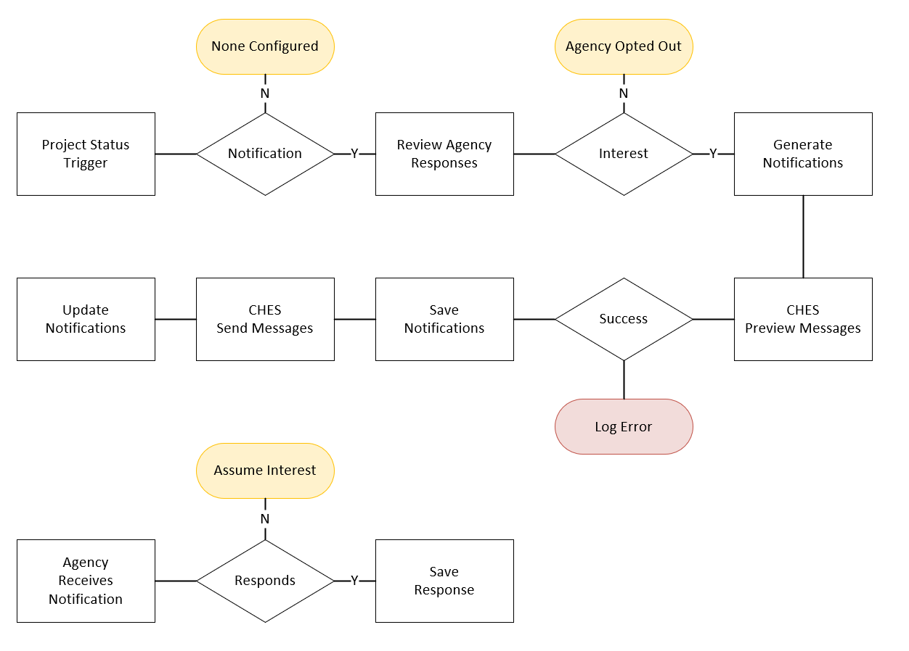
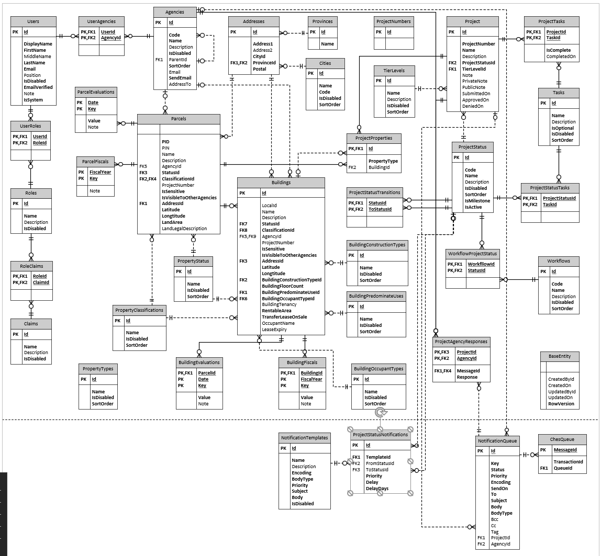

# Notifications

> NOTE - This represents the proposed design of the **Notification Workflow Engine**, not the current implementation.

PIMS requires the ability to send email notifications to agencies to inform them of properties that are approved for the Enhanced Referral Program (ERP).

To support email notifications PIMS will be required to maintain a list of notification templates that can be populated with data through variable insertion.
Additionally notifications will need to be sent based on workflow triggers and allow for adhoc triggers.

### Challenges / Issues

There are a number of challenges depending on requirements that will stil need to be solved;

- If complex templates are required (iterating over multiple property details) a dynamic engine will need to be implemented (i.e. Razor, Node, etc.).
- Once notifications are sent to **CHES** this current implementation does not verify or update the status, which essentially leaves all notifications as `pending` within PIMS, regardless of **CHES** status.

## Workflow

Notification templates will be created to support dynamic content.
These templates will be associated with project status transitions.
This will allow the **Simple Workflow Engine** to determine whether a notification should be generated and sent when specific conditions are met (from status to status event).
When a notification trigger occurs a check against existing responses will be reviewed to determine whether there is an expressed interest on receive additional notifications.
If the agency has responded to with a no desire for additional notifications, no notification will be generated.
Otherwise a notification will be generated and added to the queue.

Generated notifications can include a callback (URL link) to capture a response.
This callback can be the API endpoint to record the recipients response.

To support delayed notifications, the project status trigger will also include a `Delay` parameter that provides the following options;

| Delay      | Description                                                                   |
| ---------- | ----------------------------------------------------------------------------- |
| None       | Immediately send this notification                                            |
| EndOfDay   | Send notification on the current day at midnight                              |
| EndOfMonth | Send notification on the current end of month at midnight                     |
| Days       | Send notification `x` days from the current date, using the `DelayDays` value |
| SetDay     | Prompt the user to select a date that the notification will be sent on        |

### API Notication Response

The API will have an endpoint `/api/notifications/{key}/{response}` that will provide a way for recipients to click a link in their notification to inform PIMS of interest or the lack thereof.
The API will validate the `Key` and record the response for the appropriate agency and project.

> RISK - It is possible a bad agent could spam this endpoint and flood the API with fake responses, but it would still be limited to only valid `Key` values.

## Notification Templates

A notification template provides a way to reuse an notification subject and body for multiple emails.

The following templates will need to be provided;

- Inform Agencies of new properties in the ERP.
- Inform interested agencies of workflow events (30, 60, 90 days) while in ERP.

### Variables

To support template the following variable contexts will be supported;

- `{{ Property.* }}` - any property field that will be included (i.e. Property.Name, Property.Address.Address1, Property.Agency.AddressTo)
- `{{ Project.* }}` - any project field that will be included (i.e. Project.Name, Project.ProjectNumber)
- `{{ NotificationKey }}` - the unique key to identify the notification

The `NotificationTemplate` entity will need to include the following properties;

| Name        | Type          | Required | Constraint                    | Description                                        |
| ----------- | ------------- | :------: | ----------------------------- | -------------------------------------------------- |
| Id          | int           | PRIMARY  | IDENTITY                      | Unique identity within PIMS                        |
| Name        | nvarchar(100) |   yes    |                               | A unique name to identify the template             |
| Description | nvarchar(500) |          |                               | A description of the template and its purpose      |
| Encoding    | nvarchar(50)  |   yes    | [base64, bindary, hex, utf-8] | Notification encoding                              |
| BodyType    | nvarchar(50)  |   yes    | [html, text]                  | Notification message body type                     |
| Priority    | int           |   yes    | [normal, low, high]           | Notification default priority                      |
| Subject     | nvarchar(200) |   yes    |                               | Notification subject line (supports variables)     |
| Body        | nvarchar(max) |   yes    |                               | Notification message template (supports variables) |
| IsDisabled  | bit           |   yes    |                               | Whether the template is disabled                   |

## Agencies

The `Agency` entity will need to include the following properties;

| Name      | Type          | Required | Constraint | Description                                                                          |
| --------- | ------------- | :------: | ---------- | ------------------------------------------------------------------------------------ |
| Email     | nvarchar(250) |          |            | Email address (semi-colon delimiter) that will receive notification emails from PIMS |
| SendEmail | bit           |   yes    |            | Whether notification emails should be sent to the agency                             |
| AddressTo | nvarchar(100) |          |            | The person/entity to address the notifaction to                                      |

## Project Status Notifications

To automate the sending of emails and associating them to a workflow project status, each `NotificationTemplate` will be linked to a `ProjectStatus`.

Notifications will be triggered when the `FromStatus` and/or `ToStatus` conditions are met during the workflow project lifecycle.

| Name         | Type | Required | Constraint                                 | Description                                                                     |
| ------------ | ---- | :------: | ------------------------------------------ | ------------------------------------------------------------------------------- |
| Id           | int  | PRIMARY  | IDENTITY                                   | Unique identity within PIMS                                                     |
| TemplateId   | int  |   yes    | FOREIGN                                    | Link to the template that this trigger will use when generating an notification |
| FromStatusId | int  |          | FOREIGN                                    | Link to the project status that will trigger this notification                  |
| ToStatusId   | int  |          | FOREIGN                                    | Link to the project status that will trigger this notification                  |
| Priority     | int  |   yes    | [normal, low, high]                        | The priority of the notification that will be sent                              |
| Delay        | int  |   yes    | [none, endOfDay, endOfMonth, days, setDay] | Controls when a notification will be sent                                       |
| DelayDays    | int  |   yes    |                                            | Number of days to delay sending notification                                    |

## Project Agency Response

When a notification is sent a unique key will be generated that will allow responses to the notification to be tracked and acted upon.
These responses will be stored and used to determine future notification decisions.

| Name      | Type | Required | Constraint      | Description                                                                             |
| --------- | ---- | :------: | --------------- | --------------------------------------------------------------------------------------- |
| ProjectId | int  | PRIMARY  | FORIEGN         | Link to the project that this notification is related to                                |
| AgencyId  | int  | PRIMARY  | FORIEGN         | Link to the agency that this notification was sent to                                   |
| MessageId | int  |   yes    | FORIEGN         | Link to the notification that was sent                                                  |
| Response  | int  |   yes    | [ignore, watch] | A way for agencies to indicate interest or the lack thereof in the notification subject |

## Notification Queue

A notification queue will be maintained to capture all generated notifications and their current status.
Additionally this will provide a future ability to resend or cancel notifications.

| Name      | Type             | Required | Constraint                                        | Description                                                             |
| --------- | ---------------- | :------: | ------------------------------------------------- | ----------------------------------------------------------------------- |
| Id        | int              | PRIMARY  | IDENTITY                                          | Unique identifier within PIMS                                           |
| Key       | uniqueidentifier |   yes    |                                                   | Unique key to identify the messages when agencies respond               |
| Status    | int              |   yes    | [accepted, cancelled, completed, failed, pending] | The currently known status of the notification within CHES              |
| Priority  | int              |   yes    | [normal, low, high]                               | The email priority                                                      |
| Encoding  | nvarchar(50)     |   yes    | [base64, bindary, hex, utf-8]                     | The email encoding                                                      |
| SendOn    | datetime2        |   yes    |                                                   | Desired UTC time for sending the message. 0 = Queue to send immediately |
| To        | nvarchar(100)    |   yes    |                                                   | Email address sent to                                                   |
| Subject   | nvarchar(200)    |   yes    |                                                   | Email subject line                                                      |
| BodyType  | nvarchar(50)     |   yes    | [html, text]                                      | Email body type                                                         |
| Body      | nvarchar(max)    |   yes    |                                                   | Email message                                                           |
| Bcc       | nvarchar(100)    |   yes    |                                                   | Email blind carbon copy                                                 |
| Cc        | nvarchar(100)    |   yes    |                                                   | Email carbon copy                                                       |
| Tag       | nvarchar(50)     |          |                                                   | Notification tag to identify related notifications                      |
| ProjectId | int              |          | FORIEGN                                           | Link to the project that this notification is related to                |
| AgencyId  | int              |          | FORIEGN                                           | Link to the agency that this notification was sent to                   |

## CHES Queue

To manage the relationship with **CHES** a queue will be maintained with a link to the appropriate `MessageId` and `TransactionId`.

| Name          | Type             | Required | Constraint | Description                        |
| ------------- | ---------------- | :------: | ---------- | ---------------------------------- |
| MessageId     | uniqueidentifier | PRIMARY  |            | Message identifier within CHES     |
| TransactionId | uniqueidentifier | PRIMARY  |            | Transaction identifier within CHES |
| QueueId       | int              |   yes    | FORIEGN    | Link to the notification queue     |

## Entity Relational Diagram

