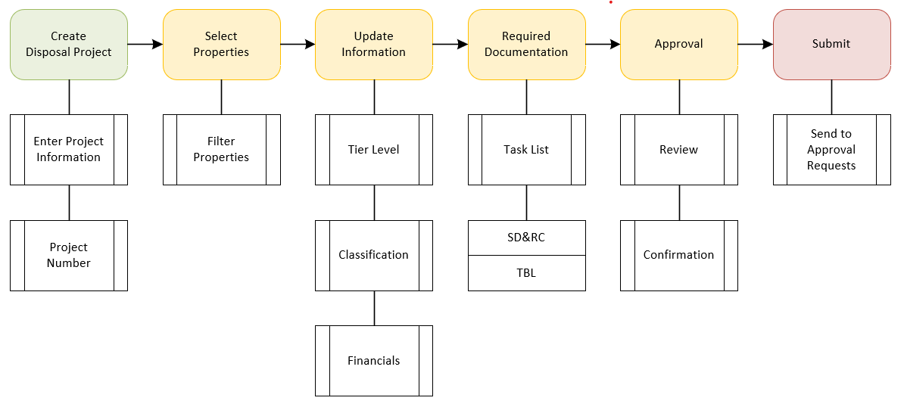

# Submit Surplus Property Process Project

A Surplus Property Process Project provides an agency the ability to bundle properties into a project they would like to dispose and submit to be added to the Surplus Property Program.

## Process

To assist agencies to follow policy when submitting a Surplus Property Process Project the following process is provided.

1. Create a new Disposal Project
2. Select Properties
3. Update Information
4. Required Documentation
5. Approval
6. Submit

### Required Documentation

The following documents are required by policy.

- Surplus Declaration & Readiness Checklist
- Triple Bottom Line

### Workflow

