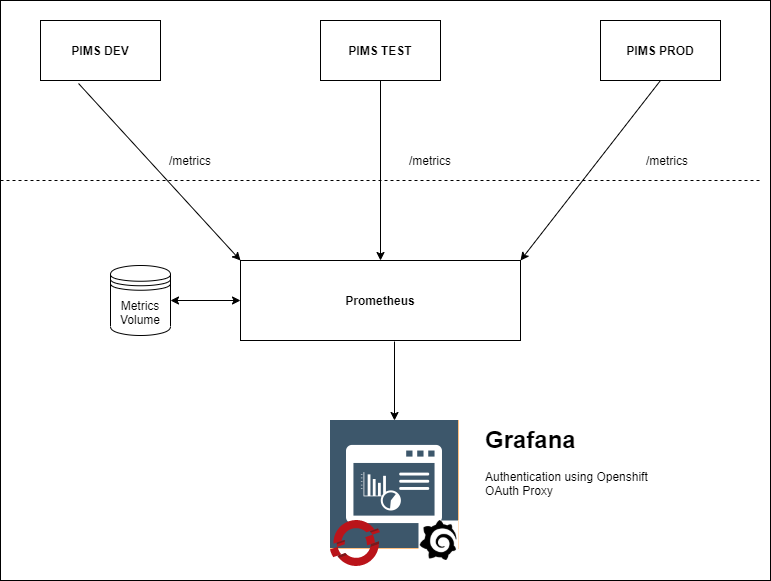

# Configure PIMS Monitoring

PIMS monitoring uses Prometheus to collect metrics from the PIMS API, and Grafana dashboards to visualize the metrics.



## Prometheus Configuration

1. To enable Prometheus in the PIMS DotNet API

```
dotnet add package prometheus-net.AspNetCore
dotnet restore
```

Add the following code in the StartUp.cs => Configure Method to enable the /metrics endpoint in the api

```
 public void Configure(IApplicationBuilder app, IWebHostEnvironment env, IApiVersionDescriptionProvider provider)
        {
            app.UseMetricServer();
            app.UseHttpMetrics();
        }
```

2. Prometheus is deployed to the PIMS tools project in OpenShift (using the prometheus-template.yml - PIMS Prometheus) to target the development, test and production deployment of the API

## Grafana Configuration (PIMS Grafana template)

Grafana uses Prometheus as a datasource to display and visualize the metrics collected from the API deployments. Grafana is also configured to use Github to authenticate users to view the dashboard

Apply the grafana-template.yml to Openshift and deploy an instance of Grafana from the Console. Make sure that all required fields are filled out.

Our Grafana dashboard uses Openshift OAuth to authenticate users and only users with access to the PIMS project are allowed. By default the Grafana deployment will assign all users an Admin role on signup, and it is recommended to change the default role assignment to `Viewer` after the first Admin user is logged in. Only Admin users can change other users permissions.
