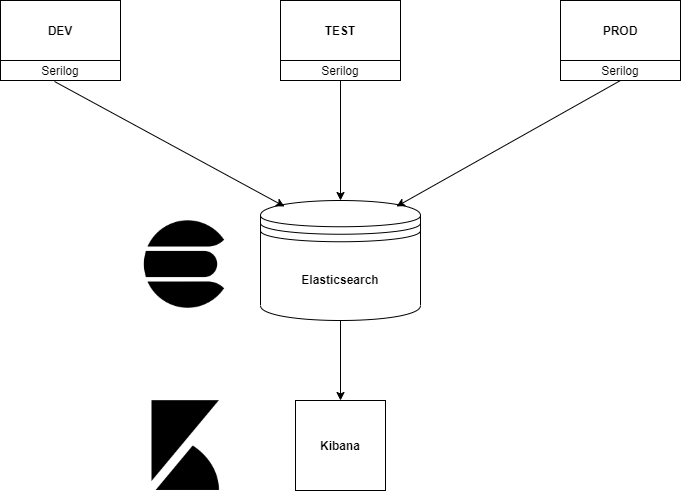

# Configure logging

PIMS logging uses Elasticsearch to collect logs from the PIMS API, and Kibana dashboards for searching and displaying logs.

## Elasticsearch

Elasticsearch is a search engine based on the Lucene library. It provides a distributed, multitenant-capable full-text search engine with an HTTP web interface and schema-free JSON documents.

Elasticsearch is deployed in the PIMS tools in Openshift. The PIMS backend API is configured to send its logs to an Elasticsearch index based on its environment.

1. Development environment => `pims-api-dev-*`
1. Test environment => `pims-api-test-*`
1. Production environment => `pims-api-prod-*`

## Kibana

Kibana is deployed in the PIMS tools in Openshift. Kibana connects to Elasticsearch and queries the PIMS API logs and displays theme.

### Deploying Elasticsearch and Kibana

You will need to be authenticated to access Kibana. By default Kibana and Elasticsearch has a built in user called `elastic` (Super admin, credentials should be distributed with caution) with a password `changeMe`. After deploying Elasticsearch, change the default password by running this command inside the container,

`bin/elasticsearch-setup-passwords auto`

The command generates random password for the built-in users, note down the password for the `elastic` user.

After deploying Elasticsearch using the template (PIMS Monitoring) in Openshift and generating the password, deploy Kibana (PIMS Kibana) and fill out all required inputs including the Elasticsearch password, and

Visit the Kibana application [here](<https://pims-kibana.pathfinder.gov.bc.ca/app/kibana#/home?_g=()>) and signin using username `elastic` and the password.

The `elastic` user has administrative permissions and should provision other users. The current password for the `elastic` user can be retrieve from the secret `pims-kibana-elasticsearch-password-secret` in the `jcxjin-tools` Openshift project namespace .
