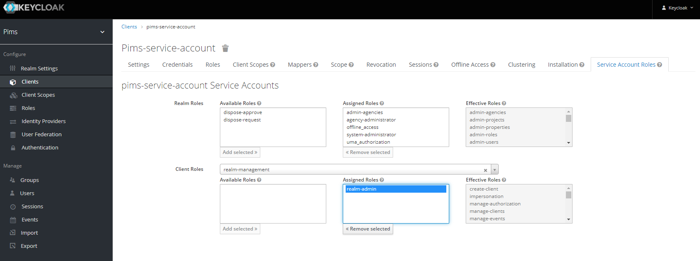

# Keycloak Sync Tool

The Keycloak Sync Tool provides a way to configure Keycloak so that PIMS will work correctly.
This includes creating Keycloak Roles, Groups and Clients and configuring each to have the correct settings.
The tool will align the PIMS database users, roles and claims with Keycloak objects.
Additionally any users within Keycloak will be added to PIMS.

## Configuration

Configuration is primarily setup for default settings within the `appsettings.*.json` files.
The only `.env` settings required are listed below in the **Setup** section.

| Key                                                  | Type   | Default                                | Description                                                               |
| ---------------------------------------------------- | ------ | -------------------------------------- | ------------------------------------------------------------------------- |
| ASPNETCORE_ENVIRONMENT                               | string | [Local, Development, Test, Production] | The environment controls what configuration files is used                 |
| Api\_\_Uri                                           | URI    | environment specific                   | The URI to the PIMS API                                                   |
| Auth*\_OpenIdConnect*\_Token                         | URI    | environment specific                   | The URI to the Keycloak Token Request endpoint                            |
| Auth*\_Keycloak*\_Realm                              | string | environment specific                   | The Keycloak Realm name                                                   |
| Auth*\_Keycloak*\_Authority                          | URI    | environment specific                   | The URI to the Keycloak authority instance                                |
| Auth*\_Keycloak*\_Audience                           | string | pims-service-account                   | The name of the Keycloak service account                                  |
| Auth*\_Keycloak*\_Client                             | string | pims-service-account                   | The name of the Keycloak service account                                  |
| Auth*\_Keycloak*\_Secret                             | string | environment specific                   | The Keycloak service account client secret                                |
| Auth*\_Keycloak*\_Admin\_\_Authority                 | URI    | environment specific                   | The URI to the Keycloak Admin authority instance                          |
| RetryAfterFailures                                   | bool   | true                                   | Whether to retry after a failure                                          |
| RetryAttempts                                        | number | 2                                      | How many attempts will be made before a failure is logged                 |
| AbortAfterFailure                                    | number | 1                                      | How many failures should be allowed before aborting process               |
| Serialization\_\_Json\_\_IgnoreNullValues            | bool   | true                                   | Whether to ignore null values when serializing JSON [true, false].        |
| Serialization\_\_Json\_\_PropertyNameCaseInsensitive | bool   | true                                   | Whether to ignore case sensitivity when deserializing JSON [true, false]. |
| Serialization\_\_Json\_\_PropertyNamingPolicy        | string | CamelCase                              | What property naming policy to use when serializing JSON [CamelCase].     |
| Serialization\_\_Json\_\_WriteIndented               | bool   | true                                   | Whether to indent serialized JSON [true, false].                          |

## Setup and Run

Create a `.env` file with the following key;

```conf
# Local
ASPNETCORE_ENVIRONMENT=Local
Auth__Keycloak__Secret={Keycloak Service Account Secret}
```

If you have already run the Keycloak Sync Tool in the past against the specific Keycloak instance you can now simply;

```bash
dotnet run
```

### First Time Run

When running the Keycloak Sync Tool for the first time against a new installation of a Keycloak instance you will need to perform a number of manual steps.
These steps are not required on an existing Keycloak instance you have already run this tool against.

First login to Keycloak, create the `pims-service-account` Client and apply the appropropriate roles for this tool to work.

> When I find time I will update the Keycloak Sync Tool to no longer require these manual steps.

1. Login to Keycloak Realm
2. Create the `pims` Realm
   1. Name = `pims`
3. Create the `pims-service-account` Client

   1. Client ID = `pims-service-account`
   2. Client Protocol = `openid-connect`
   3. Root URL = `http://localhost:3000/api`

   #### Settings

   - Login Theme = `keycloak`
   - Access Type = `confidential`
   - Standard Flow Enabled = `true`
   - Implicit Flow Enabled = `false`
   - Direct Access Grants Enabled = `true`
   - Service Accounts Enabled = `true`
   - Authorization Enabled = `false`
   - Root URL = `http://localhost:3000/api`
   - Valid Redirect URIs = `http://localhost:3000/api/*`
   - Base URL = `/`
   - Web Origins = `*`

   #### Service Account Roles

   - Client Roles = `realm-management`
   - Assigned Roles = `realm-admin`

   

4. Copy the Client Secret and place it in your `.env` file. And update the environment value to the appropiate one _[Local, Development, Test, Production]_.\_

   Modify the `/tools/keycloak/sync/.env`

   ```conf
   ASPNETCORE_ENVIRONMENT=Local
   Auth__Keycloak__Secret={Keycloak client secret}
   ```

   Modify the `/tools/import/.env`

   ```conf
   ASPNETCORE_ENVIRONMENT=Local
   Auth__Keycloak__Secret={Keycloak client secret}
   ```

   Modify the `/backend/api/.env`

   ```conf
   Keycloak__ServiceAccount__Secret={Keycloak client secret}
   ```

5. Run the Keycloak Sync Tool

   ```bash
   dotnet run
   ```

> NOTE - If you have users in your pims database that have `agencies` attributes of non-existing agencies, you will receive errors in the last portion of the sync when attempting to reconcile users. You can ignore these errors for the most part, but realize that the users will need to be manually updated with correct agency values when you login to PIMS (using a **System Administrator** account).

6. Add users to Keycloak

   - Login to Keycloak and select the **PIMS Realm**
   - Go to **Manage - Users**
   - Click **Add user** button and fill out form, click **Save** button
   - Go to the new user's **Credentials** tab and enter a password
